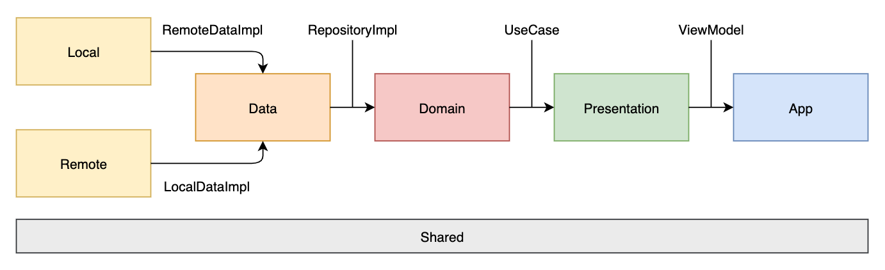

# Star Wars Jetpack

A sample application to show how implements the Clean Architecture with the new features of Jetpack.

The project tries demonstrate how implement a project uncoupled trying to follow the all of concepts of [Clean Architecture](https://blog.cleancoder.com/uncle-bob/2012/08/13/the-clean-architecture.html).

In ocasion the project was implemeted with [SOLID](https://en.wikipedia.org/wiki/SOLID) concepts to have a better code organization. '-'

## Architecture:

* __Local__
  
  Containts the implementation of LocalData interface, translating the libraries included in this layer. The room persistence and shared preferences (Until this moment) was implemented in this layer to segregate all local dependencies in project. 

* __Remote__
  
  Containts the implementation of RemoteData. This layer includes all external requests, retrofit was inserted here. 
  
* __Data__

  Contains the implementation of repository. This layer translate all data received by remote and local sources, your respectives interfaces are injected in repository implementation.

* __Domain__

  In this layer we can do our business rules consuming the interfarce of repositories or other use cases. 
  
  ** Coming soon I try to grow the project to use this [functional use case composition](https://medium.com/@june.pravin/clean-architecture-functional-style-use-case-composition-with-rxjava-kotlin-898726c97dfe).

* __Presention__

  Consumes the repository through viewmodel. Your view logic is here. :)
  
* __App__

  The injection of view models is here, at this layer the project is applying the jetpack navigation in only one activity.

* __Shared__

  This module contains all shared methods and common classes in project, in my case the mapper are used in bounders of modules.

** Extension methods are applied to their respective layer using internal modifier, making them invisible to others layers.

## Gradle
In project we have some gradle scripts representing a default setup for respective layer, there was created to decrease the boiler plate in scripts.

* __default-config__

  Include android default config and your build types.

* __android-build__

  Represents android setup, all layers needing android specifies include this script in your local gradle.

* __commons__

  Include common project dependencies in module.
  
## Libraries
* Android Components
* Material Components
* [Jetpack Libraries](https://developer.android.com/jetpack/)
* [CircleImageView](https://github.com/hdodenhof/CircleImageView)
* [Koin](https://github.com/InsertKoinIO/koin)
* [Retrofit](https://square.github.io/retrofit/)
* [OkHttp](https://square.github.io/okhttp/)
* [RxKotlin](https://github.com/ReactiveX/RxKotlin)
* JUnit
* [Mockito](http://site.mockito.org/)
* [MockitoKotlin](https://github.com/nhaarman/mockito-kotlin)

For more specifies consult the wiki... The complete project wiki coming soon

Inspired by: [Nelson Glauber - Books Jetpack](https://github.com/nglauber/books_jetpack)
